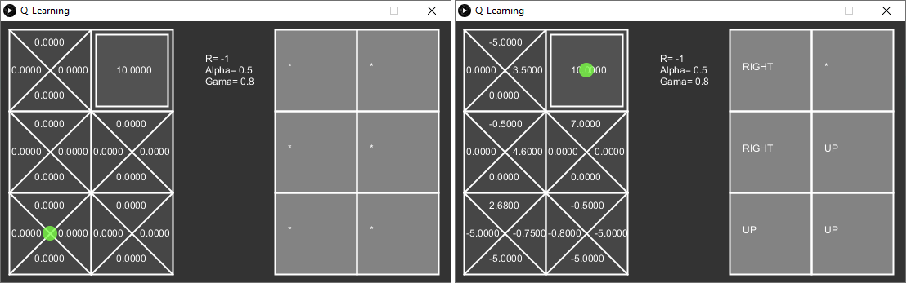

# -.CLASS-PROTOTYPE.-Q_Learning

## Requirements

#### [Python 3](https://www.python.org/downloads/)
#### [Processing 3](https://processing.org/download/) 
* Python Mode for Processing 3 by Jonathan Feinberg

## Description

#### Q Learning algorithm developed for the class of cognitive and adaptive agents.

#### It simulates an agent moving through the board, measuring the utility and policy of every state that it move on.

#### Using Q(s,a) <- Q(s,a) + alpha[r + gama * max(Q(s+1,a)) - Q(s,a)] to calculate the utility

## How to use

#### It has two modes, one that it is manually moved, and other that it moves seeking for the highest utility value, to get to the terminal state, and both can be used simultaneously.

#### Press "W" to move up, "D" to move right, "S" to move down and "A" to move left.

#### Press the space bar to run it automatically until it finds the terminal states.

#### Press "R" to restart the board, utilities and agent.

#### The QLearning class has some parammiters.

#### QLearning( r, d, ui_width, ui_height, dI, dJ ,rows = 3, cols = 2, a = 0.5, g = 0.8)

* r : Is the immediate reward of the movement
* d : Is the punishment to when the agent hits the wall
* ui_width : Is the width value where the board will be draw
* ui_height : Is the height value where the board will be draw 
* dI : Is the initial "i" position of the agent and can not be greater than the number of rows
* dJ : Is the initial "j" position of the agent and can not be greater than the number of columns
* rows : Is the number of rows of the board, by default it is 3
* cols : Is the number of columns of the board, by default it is 2
* a : Alpha is the learning rate, by default it is 0.5
* g  : Gama is the discount factor, by default it is 0.8

